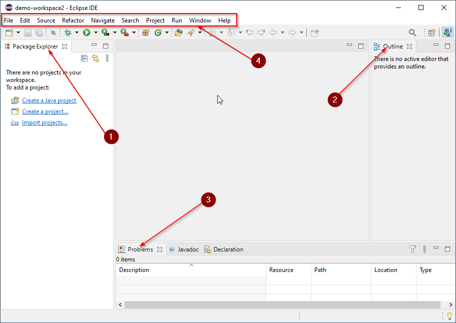
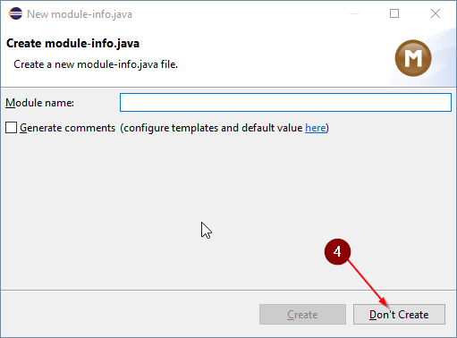
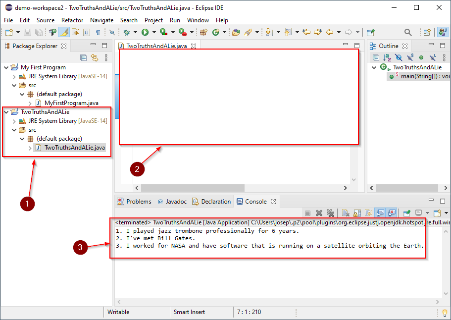

# Getting Started with Eclipse

## Before Starting

Before starting this activity, you should have Eclipse installed on your
computer. As of the time of writing this, you can download a copy of Eclipse
here: [LINK](https://www.eclipse.org/downloads/)

## Eclipse Overview

### Launching Eclipse

Start by launching Eclipse. The first time you start the program, you will be
greeted by a window that looks similar to the one below. Yours may not be
identical.

1. A "workspace" will be set by default in the Workspace section. This is the
   location on your computer that Eclipse will store files. You do not need to
   change this.
2. There is a checkbox which, if selected, will use the selected workspace by
   default rather than asking each time you start Eclipse. I recommend leaving
   this unchecked.
3. When you're ready to launch eclipse, click the Launch button.

### Welcome to Eclipse

The first time Eclipse opens a workspace, you will be greeted with a Welcome
screen. Again, the screenshot below may not be identical to yours but it should
be similar.

1. You usually see a `Welcome` tab the first time you open Eclipse.
2. You can close this tab by clicking the `X` on the tab.

After closing the `Welcome` tab. Eclipse will switch to the default Java view:

1. On the left, you will find the `Package Explorer`. This section will show
   your projects as you add them.
2. On the right, is the `Outline`. This will show an outline of the current file
   that is open.
3. On the bottom, is the `Problems` tab. This will show all of the problems that
   are currently present in your projects.
4. At the top, you can find the `Top Menu`. On Mac, this is not part of the
   window but is at the top of the desktop screen. You will use this to access
   various features that Eclipse provides.

## Creating a new Java Project

Let's start by creating a new Java Project to learn some of the basics of Java.

1. From the `Top Menu`, select `File` > `New` > `Java Project`

This will open the `New Java Project Wizard`

2. Set the `Project name` to be `My First Program`
3. Click `Finish`

4. If you're prompted to `Create module-info.java` click `Don't Create`

5. After a moment, you should see a project in your `Package Explorer` called
   `My First Program`
6. Next, click the small arrow next to your new project.

This will expand your project so you can see all of the files within. By
default, there isn't much in your project. It should have a `JRE` (Java Runtime
Environment) and a `src` folder. This is an abbreviation for "source" which will
contain your projects "Source Code".

## Creating a Simple Program

Next, we will create a very basic Java Program.

1. Right click on your projects `src` folder.
2. Select `New` > `Class`

This will open the `New Java Class Wizard`. In Java, all of the code is stored
within a "Class".

3. Name your class "MyFirstProgram"
   * Notice there are no spaces in the class name but each word is capitalized.
     In Java, class names may not have spaces. Additionally, it is considered a
     best practice to capitalize each letter of a word in a class name. This is
     called Camel Case.
4. Check the box that says `public static void main(String[] args)`
5. Click Finish

6. If all goes well, a new file named `MyFirstProgram.java` will be added to a
   `(default package)` within your `src` folder.
7. The `MyFirstProgram.java` file should open by default and occupy the main
   area of the eclipse editor.
8. You can run your program by clicking the run button at the top of the eclipse
   editor.

When you click the run button, it seems like nothing much happens. This is
because your program doesn't do anything yet. The program that you wrote starts
and then immediately closes.

### Printing to the Console

A program that exits immediately isn't particularly useful. Next, let's add a
little bit of code to make our program do something.

1. Update your program to match the code below.
   * The code you add must be identical to the code in the image.
2. The asterisk (`*`) next to a file name in the editor means the file is
   unsaved.
3. Make sure to save your work using the `Top Menu` (`File` > `Save All`).

4. Click the Run button.
5. You will notice a `Console` tab appear on the bottom section of Eclipse
6. The text that you added will be displayed in the `Console`

7. Let's add a few more lines of code. Update your code:

8. Don't forget to save.
9. Click Run
10. Notice the console will update with the text that was added to the program.

### Understanding the Code

The program you have written is very simple. It is "printing" text to the
console. Let's try to understand line by line what it does:

1. The first line of the program is `public class MyFirstProgram`

This line is declaring that we are writing a "Class" and that it is named
"MyFirstProgram". **Note:** this matches the filename we gave this class. If you
change the class name OR the filename, the program will have errors.

2. At the end of the first line we have a curly bracket `{`

Any time you see a curly bracket in Java, you are declaring a "body". Everything
within a "body" is associated with the element that precedes the opening curly
bracket. In this case, we would refer to everything after the `{` as "the body
of the MyFirstProgram class".

3. A "body" will always have a matching, closing curly bracket `}`.

Again, everything between the opening and closing curly brackets is called a
"body".

4. The next line we see is `public static void main(String[] args])`

This line has a little bit of "magic" associated with it. The important thing to
take away from this particular line of code is that it is defining the "main"
method for our program. The main method is where the program will begin
executing when the program is run.

5. Again, notice that the main method has an opening curly bracket `{`.
6. It also has a matching closing curly bracket `}`.

The section between these two curly brackets is called "the body of the main
method". Because this code is inside of the body of the `MyFirstProgram` class.
We refer to this main method as "MyFirstProgram's main method".

Finally, we get to the part of the program that is actually doing something.

7. The code `System.out.println` is called the "Print Line" method.

This code tells the program that it should "print" text to the console.

8. Every method requires an opening parenthesis `(`
9. Every method requires a closing parenthesis `)`
10. Inside of the parentheses we say that we are passing the argument `"My First
    Program!"`.

This line of code is said to be 'calling the println method with the argument
"My First Program!"'. When we call the `println` method, it will take the
provided argument and print the text to the console on a line.

11. Finally, at the end of a method call we must have a semi-colon `;`. 

The semi-colon can be thought of a "period" at the end of a sentence. It tells
the program that we want it to execute the code that comes before it on that
line.

## Challenge: Two Truths and a Lie

In this challenge, you will create a new Java Project which contains a program that prints out 3 things: 2 truths about yourself and 1 lie about yourself.

1. Create a new Java Project called "Two Truths and a Lie"
2. Inside your new project, create a new class called "TwoTruthsAndALie"
3. Inside your new class, write a main method that has 3 print statements.
    * Two of the print statements should contain true statements about yourself.
    * One of the print statements should contain a false statement about yourself.

4. Run your program.

When you're finished, take a screenshot of your Eclipse workspace showing your Project, your source code, and the output in your console then add it to this document:

**ADD YOUR SCREENSHOT HERE**

It should look similar to this:

Next, take a screenshot of just your console and post it on Google Classroom's Stream for your classmates to guess which is the lie!