# Mad Libs

## Before Starting

Before starting this activity, you should have completed the Getting Started with Eclipse activity and Two Truths and a Lie challenge. You should feel comfortable using `System.out.println` to print messages to the console.

## Variables and User Input

So far, your program always has a predetermined output. This isn’t particularly useful or interesting. However, you can read input that the user types into the console and use that to change the output of your program. In this activity, you will learn how to read user input, store the user input in a variable, and print the user’s input to the terminal.

## Launch Eclipse

Start by launching Eclipse into your workspace. If you have completed the Two Truths and a Lie challenge, your workspace should look similar to this:

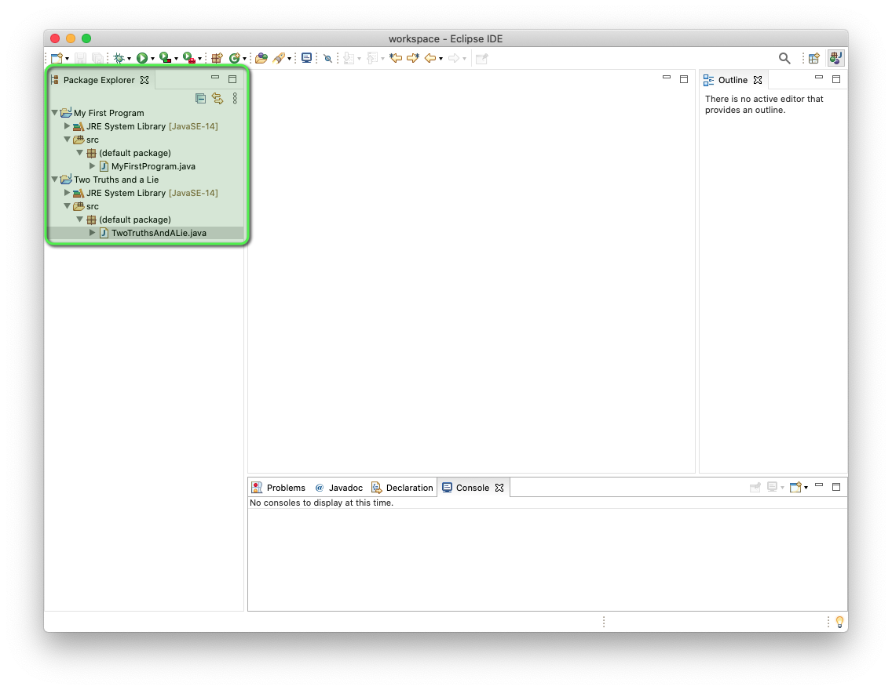

## Create a new Project

To get started, let's create a new Java Project. 

1. From the top menu, select `File` > `New` > `Java Project`

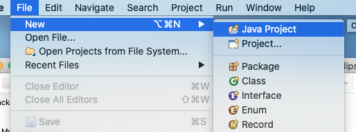

2. In the New Java Project wizard, enter the project name "Mad Libs".
3. Then, click `Finish`

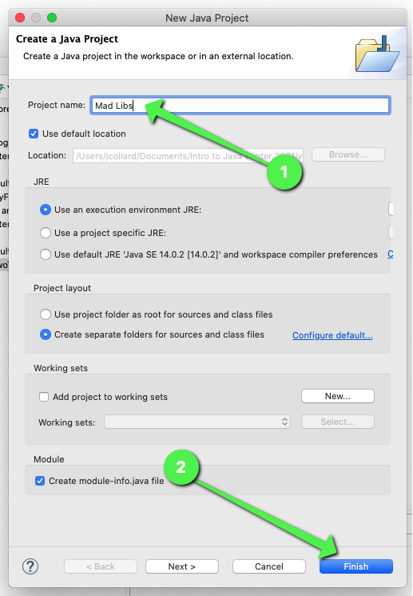

4. If prompted to create a new `moudle-info.java` file. Click `Don't Create`

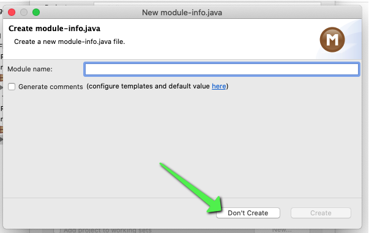

If all went well, you should see your `Mad Libs` project in the `Package Explorer`. 

5. Click the expand icon to see the contents of your project.

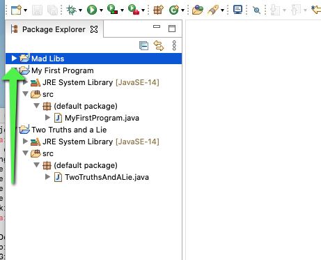

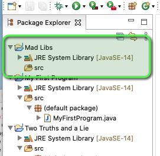

## Create a new Class File

Next, we need to create a Class file so we can write some code.

1. Right click on your `src` folder.
2. Select `New` > `Class`

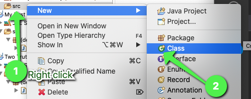

3. In the Java Class wizard, specify the name to be "MadLibs"
    * Notice, we are using camel case here (all one word no spaces with capital letters for each word)
4. Click the check box that says `public static void main(String[] args)`
5. Finally, click `Finish`

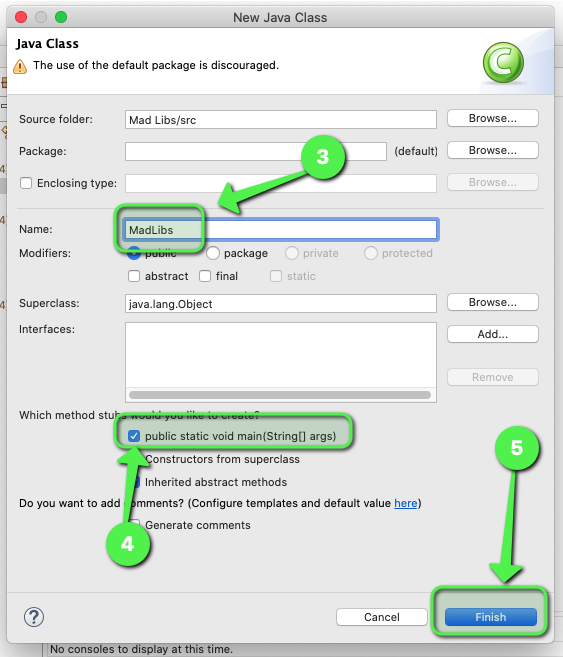

After a moment, your new Java class will be created. You should see it in your `Package Explorer`. If it does not open automagically, double click the file to open it.

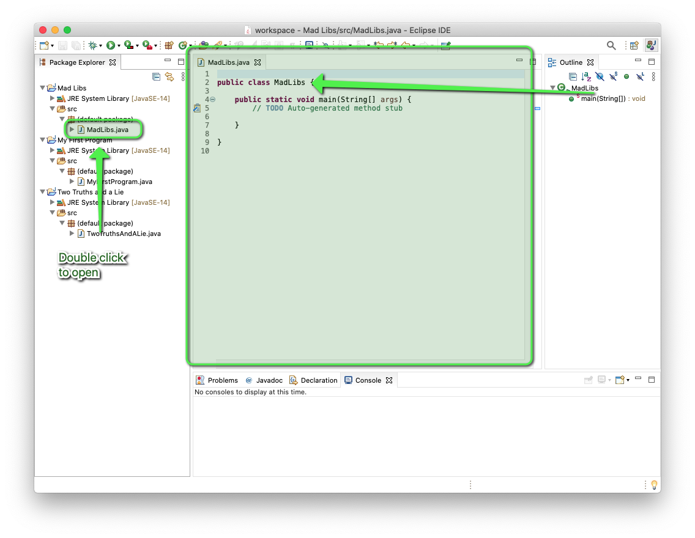

## Reading and Writing User Input

Currently, our program is **incredibly** simple. It will start for a moment and then close immediately. Let's start by creating a message that will prompt the user to enter a noun.

1. Update your code to match the code below:

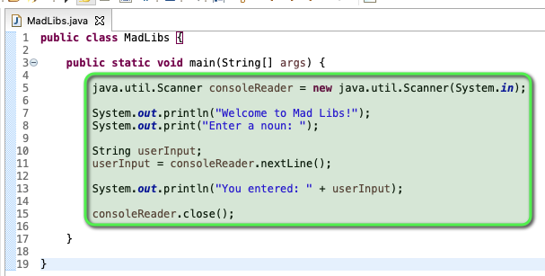

Be very careful that you copy the code exactly as it is in the picture. Computers are **VERY** picky and you need to be very specific for them to understand your commands.

2. After you have updated your code, be sure to save your work. From the top menu, select `File` > `Save All`.

3. Finally, run your program. Right click on the code area.
4. Select `Run As` > `Java Application`

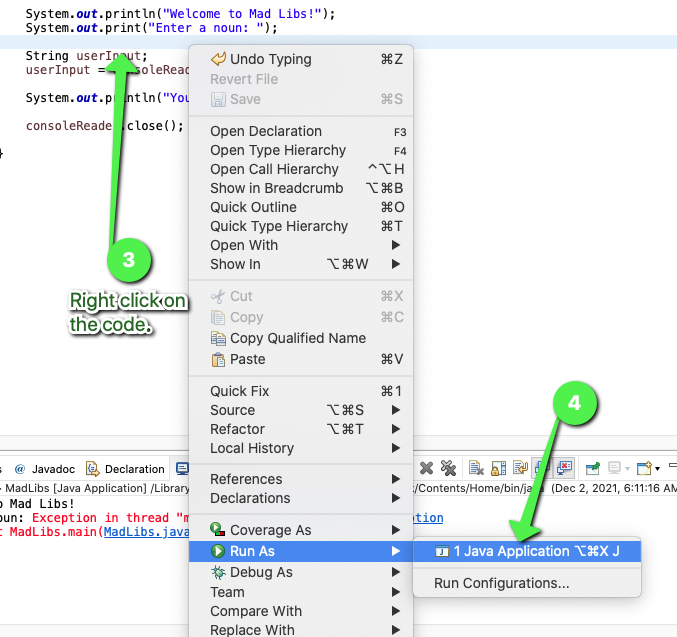

If all goes well, you should see the following text in your console area:

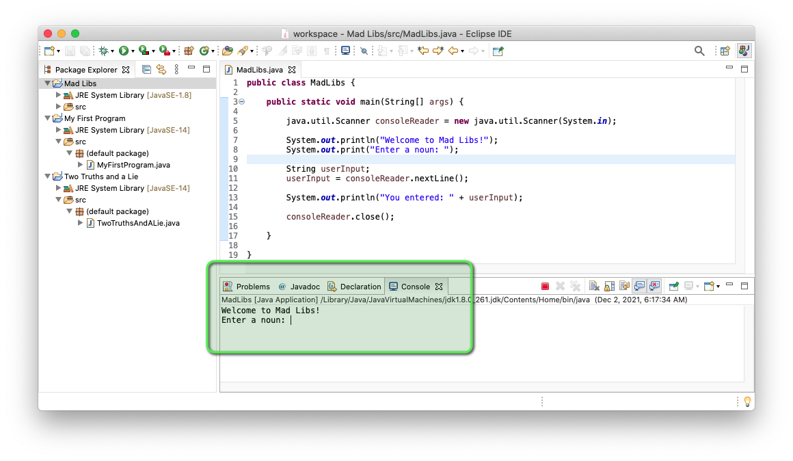

The program is waiting for you to type something into the console.

5. Click into the console.
6. Type a noun
7. Press enter

If all went well, you should see the output `You entered: {YOUR NOUN HERE}`

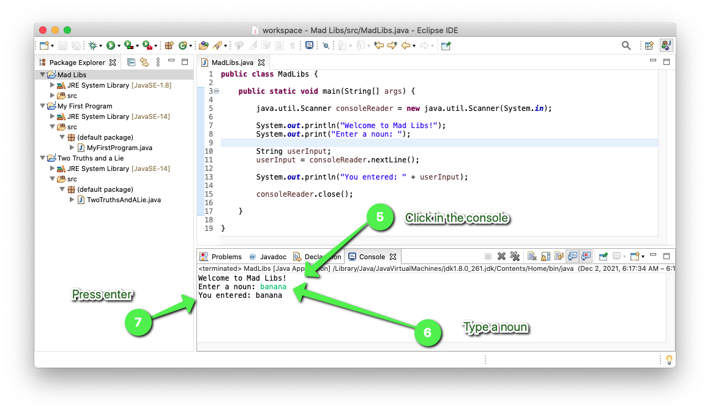

Take a screenshot of your console area and add it to this document.

**PUT YOUR SCREENSHOT HERE**

## Understanding the Code

Next, lets look at each line of code you wrote one by one and explain what it does.

1. On line 5, you wrote `java.util.Scanner consoleReader = new java.util.Scanner(System.in);`

This line of code is creating a variable called `consoleReader` that will allow us to read whatever the user types into the console. For now, it is okay to not completely understand what this line is doing. It is a little bit "magical".

2. On line 7, you wrote `System.out.println("Welcome to Mad Libs!");`

This line of code is calling a method called `println`. When spoken, we say "Print Line". This method allows us to write text to the console. In this case, we write the text `Welcome to Mad Libs!`. Notice, we put everything we want to write inside of double quotes.

3. On line 8, you wrote `System.out.print("Enter a noun: ");`. 

This is a method that is very similar to the `println` method. The only difference with this method is that it doesn't add a "new line" at the end. A "new line" is essentially the way the computer presses the "enter" key. Notice that the words `Enter a noun:` show up on the line after the `Welcome to Mad Libs!` in the terminal. This is because the `println` method put an enter at the end.

4. On line 10, you wrote `String userInput;`

This is creating a variable called `userInput`. This specific variable will store a `String`. In programming, we often call "text" a `String`. In this case, we want to be able to store what the user types in.

5. On line 11, you wrote `userInput = consoleReader.nextLine();`

This line of code first calls the method `nextLine()`. This is a method that the `consoleReader` we created on line 5 provides. This specific method allows us to read whatever the user types into the console.

After the user types something into the console and presses enter. The text that was typed will be stored in the `userInput` variable. In Java, when we see the `=` we call it the "**Assignment Operator**". This is because it assigns the data on the right side to the variable on the left side. In this case, we are assigning the text the user entered to be stored in the variable `userInput`.

6. On line 13, you wrote `System.out.println("You entered: " + userInput);`

This line of code calls the `println` method again. This time, we print out the text `You entered: ` plus the value of `userInput`. In Java, when we see the `+` being used in this way, we call this the "**Append Operator**". This is because it is appending the two strings together. Sometimes, this is called **concatenation**.

7. Finally, on line 15, you wrote `consoleReader.close();`

This line of code calls the `close()` method that is provided by the `consoleReader` we created on line 5. This method tells the computer that we are done reading text from the user. This should almost always be the very last thing in a program that reads input from the user.

Whew! That's a lot of stuff going on in this program! If something doesn't make sense yet, that is 100% okay. We will be practicing these things over and over. You will understand them soon enough!

## Challenge #1

Update your MadLibs class to ask the user to enter 2 nouns and 1 adjective. Then, using the input the program should print out a short Mad Lib.

1. Update your code by renaming the `userInput` variable to `noun1`.
   *  Hint: `String userInput;` becomes `String noun1;`.
2. Update your code to call the `consoleReader.nextLine()` method and assign the result to `noun1`.
3. Update your code to print `"Enter another noun: "`
4. Update your code to have a `String noun2;` variable.
5. Update your code to call the `consoleReader.nextLine()` method and assign the result to `noun2`.
6. Update your code to print `"Enter an adjective: "`
7. Update your code to have a `String adjective` variable.
8. Update your code to call the `consoleReader.nextLine()` method and assign the result to `adjective`.
9.  Update your code to print the resulting Mad Lib `"The " + adjective + " " + noun1 + " looks like a " + noun2`

When you're finished, run your program. The output should look similar to this:

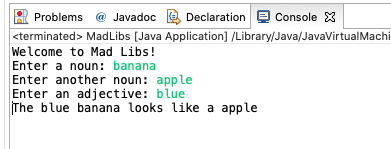

Take a screenshot of Eclipse. This screenshot should include:

1. Your `Package Explorer` showing your `Mad Libs` project fully expanded.
2. Your `MadLibs.java` program source code.
3. The result of running your program in the Console.

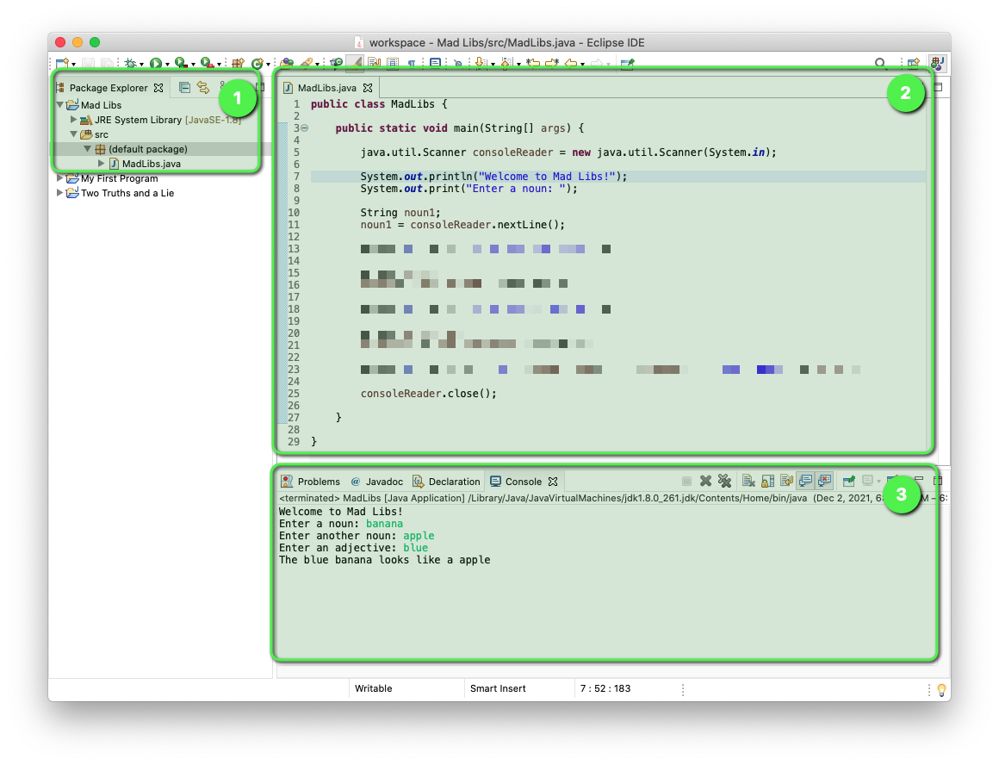

**PUT YOUR SCREENSHOT HERE**

## Challenge #2

Update your program to create a Mad Lib of your choosing. It should contain at least 8 user inputs and have at least 3 sentences. If you’re having trouble coming up with a Mad Lib, you may use this website for inspiration: [https://www.madtakes.com/](https://www.madtakes.com/)

When you're finished, run your program to make sure it works. Then, have a friend play your Mad Lib.

Take a screenshot of Eclipse. This screenshot should include:

1. Your `Package Explorer` showing your `Mad Libs` project fully expanded.
2. Your `MadLibs.java` program source code.
3. The result of running your program in the Console.

**PUT YOUR SCREENSHOT HERE**

Finally, take a screenshot of just your console output and post it to the Google Classroom Stream.